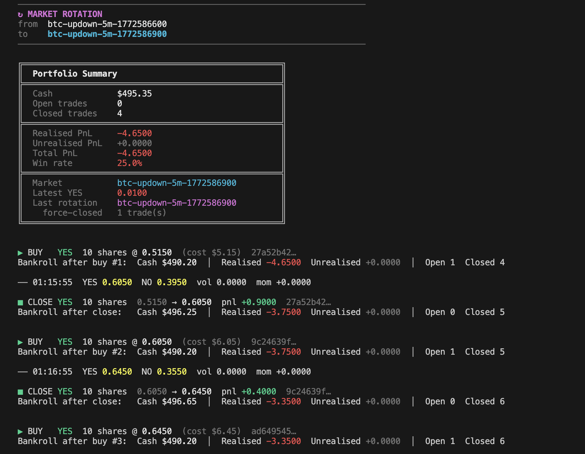

# polymarket-trader

A Python paper trading library for [Polymarket](https://polymarket.com) prediction markets.
Connect to any market via WebSocket, trade YES/NO positions with simulated cash, and let the library handle reconnection, market rotation, and crash-safe state persistence.



```python
import asyncio
from polymarket_trader import PaperTrader
from polymarket_trader.models import PriceTick

trader = PaperTrader(asset="btc", interval="5m", initial_cash=500.0)

async def on_tick(event):
    if isinstance(event, PriceTick):
        trade = trader.buy("YES", shares=10)

asyncio.run(trader.stream(on_tick))
```

---

## Table of Contents

- [Requirements & Installation](#requirements--installation)
- [How It Works](#how-it-works)
- [Quickstart](#quickstart)
- [Core Concepts](#core-concepts)
  - [Market IDs](#market-ids)
  - [YES / NO pricing](#yes--no-pricing)
  - [Market rotation](#market-rotation)
  - [Crash recovery](#crash-recovery)
- [Using in Your Project](#using-in-your-project)
  - [Install from source](#install-from-source)
  - [Minimal integration](#minimal-integration)
  - [What data arrives on every tick](#what-data-arrives-on-every-tick)
  - [Reading the order book](#reading-the-order-book)
  - [Computing signals from order book data](#computing-signals-from-order-book-data)
  - [Rolling statistics with TickStats](#rolling-statistics-with-tickstats)
  - [Accessing trade history and portfolio state](#accessing-trade-history-and-portfolio-state)
  - [Placing orders from your algorithm](#placing-orders-from-your-algorithm)
  - [Fees](#fees)
  - [Order Types](#order-types)
  - [Using the raw feed without PaperTrader](#using-the-raw-feed-without-papertrader)
  - [Running multiple markets in parallel](#running-multiple-markets-in-parallel)
  - [Building a strategy class](#building-a-strategy-class)
  - [Integrating with FastAPI](#integrating-with-fastapi)
  - [Writing data to a file or database](#writing-data-to-a-file-or-database)
- [API Reference](#api-reference)
  - [PaperTrader](#papertrader)
  - [PriceTick](#pricetick)
  - [MarketRotationTick](#marketrotationtick)
  - [OrderBook & Level](#orderbook--level)
  - [Trade](#trade)
  - [Portfolio](#portfolio)
  - [MarketSpec & MarketClock](#marketspec--marketclock)
  - [TickStats](#tickstats)
  - [FeeModel & fee constants](#feemodel--fee-constants)
  - [Display utilities](#display-utilities)
  - [Exceptions](#exceptions)
- [State File Schema](#state-file-schema)
- [Extending the Library](#extending-the-library)
- [Running Tests](#running-tests)

---

## Requirements & Installation

- Python **3.11+**
- `websockets >= 12`
- `certifi` (CA bundle — works on all Python installs including macOS Python.org builds)

```bash
# Development install (includes pytest)
pip install -e ".[dev]"

# Production only
pip install -e .
```

---

## How It Works

```
  ┌─────────────────────────────────────────────────────────┐
  │                    Your Script / App                    │
  │   trader = PaperTrader(asset="btc", interval="5m")      │
  │   asyncio.run(trader.stream(on_tick))                   │
  └────────────────────┬────────────────────────────────────┘
                       │  PriceTick | MarketRotationTick
  ┌────────────────────▼────────────────────────────────────┐
  │                   PaperTrader                           │
  │  • tracks latest_price          • saves state atomically│
  │  • auto-closes on rotation      • crash-safe JSON store │
  └────────────────────┬────────────────────────────────────┘
                       │
  ┌────────────────────▼────────────────────────────────────┐
  │                  PolymarketFeed                         │
  │  • resolves YES/NO token IDs (Gamma API)                │
  │  • maintains WebSocket + PING every 10s                 │
  │  • fires rotation tick 5s before window close           │
  │  • reconnect with backoff: 1s → 2s → 4s … cap 60s      │
  └────────────────────┬────────────────────────────────────┘
                       │
              wss://ws-subscriptions-clob.polymarket.com
```

Every `buy()` and `close()` is written atomically to disk. If your process dies, the next run picks up exactly where it left off.

---

## Quickstart

### BTC 5-minute

```python
import asyncio
from polymarket_trader import PaperTrader
from polymarket_trader.models import PriceTick, MarketRotationTick

trader = PaperTrader(asset="btc", interval="5m", initial_cash=500.0)
tick_count = 0

async def on_tick(event):
    global tick_count

    if isinstance(event, MarketRotationTick):
        print(f"Rotated → {event.new_market_id}")
        return

    tick_count += 1
    tick: PriceTick = event
    print(f"[{tick_count}] YES={tick.yes_price:.4f}  NO={tick.no_price:.4f}")

    if tick_count == 1:
        trade = trader.buy("YES", shares=10)
    if tick_count == 10:
        for t in trader.close_all():
            print(f"Closed pnl={t.pnl:+.4f}")

asyncio.run(trader.stream(on_tick))
```

### ETH 15-minute

```python
trader = PaperTrader(asset="eth", interval="15m", initial_cash=500.0)
asyncio.run(trader.stream(on_tick))   # same on_tick works unchanged
```

### Pin to a specific window

```python
trader = PaperTrader(market_id="btc-updown-5m-1700000300")
```

### Trade without streaming (backtesting / testing)

```python
trader = PaperTrader(asset="btc", interval="5m")
trade  = trader.buy("YES", shares=10, price=0.62)
closed = trader.close(trade.id, price=0.71)
print(f"PnL: {closed.pnl:+.4f}")   # net of fees
```

---

## Core Concepts

### Market IDs

Polymarket up/down markets are identified by:

```
{asset}-updown-{interval}-{window_start_unix_ts}
```

The timestamp is the **start** of the window (not the end). The market resolves `interval` seconds later.

```
btc-updown-5m-1700000300    # BTC, 5-min window starting at 1700000300 UTC
eth-updown-15m-1700001200   # ETH, 15-min window
btc-updown-1h-1700003600    # BTC, 1-hour window
```

`MarketClock.current(asset, interval)` computes the currently active window start for you.

### YES / NO Pricing

Each binary market has two independently priced CLOB tokens. Prices are 0–1 and roughly sum to 1:

- **YES price** ≈ probability that the asset goes **up** in this window
- **NO price**  ≈ probability that the asset goes **down**

The library reports the **midpoint** of the best bid and best ask for each token:

```
yes_price = (best_yes_bid + best_yes_ask) / 2
no_price  = (best_no_bid  + best_no_ask)  / 2
```

`yes_price` and `no_price` are for display and signal computation only. They are **not** the prices used to fill orders.

If one side is sparse, the missing price falls back to `1 - other_price`.

**Order fill prices**

When you call `buy()` or `close()` without an explicit `price=`, the library walks the real order book to compute a VWAP fill price:

- `buy("YES", ...)` fills against **YES asks** (ascending — cheapest first)
- `buy("NO", ...)` fills against **NO asks** (ascending)
- `close()` on a YES position fills against **YES bids** (descending — highest first)
- `close()` on a NO position fills against **NO bids** (descending)

If the relevant side of the book is empty, the fill falls back to the midpoint. Passing an explicit `price=` bypasses the book entirely and uses that price directly.

**PnL at close:**

| Direction | Formula |
|-----------|---------|
| YES | `(exit_fill − entry_fill) × shares` |
| NO  | `(entry_fill − exit_fill) × shares` |

`entry_fill` and `exit_fill` are the VWAP prices derived from the book (or the explicit `price=` if supplied), not the midpoint.

### Market Rotation

When a window expires, the library automatically:

1. Fires `MarketRotationTick` to your callback (~5 s before expiry)
2. Force-closes all open trades at the last known price (if `auto_close_on_rotation=True`)
3. Advances to the next window and reconnects the WebSocket

```python
# Manage rotation yourself
trader = PaperTrader(asset="btc", interval="5m", auto_close_on_rotation=False)

async def on_tick(event):
    if isinstance(event, MarketRotationTick):
        # decide what to do with open positions
        trader.close_all()
```

Force-closed trades have `trade.force_closed = True` and appear in `summary()["last_rotation"]`.

### Crash Recovery

State is written atomically using `.tmp` → `os.replace()` after every `buy()` and `close()`. On restart, `StateManager.load()` picks up the last committed portfolio automatically.

---

## Using in Your Project

### Install from source

```bash
# Into your virtual environment
pip install -e /path/to/polymarket-trader

# Or copy the package directory
cp -r polymarket-trader/polymarket_trader your_project/
```

Then import:

```python
from polymarket_trader import PaperTrader, TickStats
from polymarket_trader.models import PriceTick, MarketRotationTick, OrderBook, Level
from polymarket_trader.utils import MarketClock, MarketSpec
from polymarket_trader.websocket_feed import PolymarketFeed
```

---

### Minimal integration

The only entry point you need:

```python
import asyncio
from polymarket_trader import PaperTrader
from polymarket_trader.models import PriceTick, MarketRotationTick

trader = PaperTrader(asset="btc", interval="5m")

async def on_tick(event):
    if isinstance(event, PriceTick):
        ...   # your logic here
    elif isinstance(event, MarketRotationTick):
        ...   # window expired

asyncio.run(trader.stream(on_tick))
```

`on_tick` can be **sync or async** — the library detects this automatically.

---

### What data arrives on every tick

Every `PriceTick` carries:

```python
@dataclass
class PriceTick:
    market_id:  str        # "btc-updown-5m-1700000300"
    yes_price:  float      # YES midpoint  (0.0 – 1.0)
    no_price:   float      # NO midpoint   (0.0 – 1.0)
    timestamp:  str        # ISO 8601 UTC  "2026-03-04T12:00:01+00:00"
    order_book: OrderBook  # full CLOB snapshot — all 4 sides
```

Access any field directly:

```python
async def on_tick(event):
    if isinstance(event, PriceTick):
        print(event.yes_price)          # 0.6142
        print(event.no_price)           # 0.3858
        print(event.timestamp)          # "2026-03-04T12:00:01+00:00"
        print(event.market_id)          # "btc-updown-5m-1700000300"

        # implied spread
        spread = event.yes_price - event.no_price
        print(f"YES premium over NO: {spread:+.4f}")
```

---

### Reading the order book

The full CLOB is on every tick as `event.order_book`. Each side is a `list[Level]` (price, size pairs):

```python
async def on_tick(event):
    if not isinstance(event, PriceTick):
        return

    ob = event.order_book

    # --- 4 sides ---
    ob.yes_bids   # list[Level] — YES buyers, best price first
    ob.yes_asks   # list[Level] — YES sellers, best price first
    ob.no_bids    # list[Level] — NO buyers
    ob.no_asks    # list[Level] — NO sellers

    # --- best bid / ask for YES ---
    if ob.yes_bids:
        best_bid = ob.yes_bids[0]
        print(f"Best YES bid: {best_bid.price:.4f} x {best_bid.size:.0f} shares")

    if ob.yes_asks:
        best_ask = ob.yes_asks[0]
        print(f"Best YES ask: {best_ask.price:.4f} x {best_ask.size:.0f} shares")

    # --- top-3 levels ---
    for level in ob.yes_bids[:3]:
        print(f"  bid {level.price:.4f}  size {level.size:.0f}")

    # --- total liquidity in top 5 levels ---
    bid_liquidity = sum(l.size for l in ob.yes_bids[:5])
    ask_liquidity = sum(l.size for l in ob.yes_asks[:5])
    print(f"YES liquidity — bids: {bid_liquidity:.0f}  asks: {ask_liquidity:.0f}")

    # --- bid-ask spread ---
    if ob.yes_bids and ob.yes_asks:
        spread = ob.yes_asks[0].price - ob.yes_bids[0].price
        print(f"YES spread: {spread:.4f}")
```

---

### Computing signals from order book data

Everything is plain Python — compute whatever you need directly:

```python
from polymarket_trader.models import OrderBook, Level

def bid_ask_spread(bids: list[Level], asks: list[Level]) -> float | None:
    """Spread between best bid and best ask."""
    if not bids or not asks:
        return None
    return asks[0].price - bids[0].price

def book_imbalance(bids: list[Level], asks: list[Level], depth: int = 5) -> float | None:
    """
    Signed imbalance in [-1, +1].
    +1.0 → all size on bid side (buying pressure)
    -1.0 → all size on ask side (selling pressure)
    """
    bid_vol = sum(l.size for l in bids[:depth])
    ask_vol = sum(l.size for l in asks[:depth])
    total = bid_vol + ask_vol
    if total == 0:
        return None
    return (bid_vol - ask_vol) / total

def weighted_mid(bids: list[Level], asks: list[Level]) -> float | None:
    """
    Size-weighted midpoint — pulls toward the heavier side.
    More accurate than a simple (bid + ask) / 2.
    """
    if not bids or not asks:
        return None
    bb, ba = bids[0], asks[0]
    return (bb.price * ba.size + ba.price * bb.size) / (bb.size + ba.size)

def vwap(levels: list[Level], depth: int = 10) -> float | None:
    """Volume-weighted average price across top N levels."""
    vol = sum(l.size for l in levels[:depth])
    if vol == 0:
        return None
    return sum(l.price * l.size for l in levels[:depth]) / vol


# --- use them in your callback ---
async def on_tick(event):
    if not isinstance(event, PriceTick):
        return
    ob = event.order_book

    spread  = bid_ask_spread(ob.yes_bids, ob.yes_asks)
    imb     = book_imbalance(ob.yes_bids, ob.yes_asks)
    wmid    = weighted_mid(ob.yes_bids, ob.yes_asks)
    yes_vwap = vwap(ob.yes_bids)

    print(f"spread={spread:.4f}  imb={imb:+.2f}  wmid={wmid:.4f}  vwap={yes_vwap:.4f}")
```

---

### Rolling statistics with TickStats

`TickStats` tracks a rolling window of prices and exposes volatility, momentum, and bid/ask imbalance. Call `.update(tick)` before reading any property.

```python
from polymarket_trader import PaperTrader, TickStats
from polymarket_trader.models import PriceTick

trader = PaperTrader(asset="btc", interval="5m")
stats  = TickStats(window=20)   # rolling window of 20 ticks

async def on_tick(event):
    if not isinstance(event, PriceTick):
        return

    stats.update(event)   # always update first

    # --- available after >= 2 ticks ---
    stats.delta           # float | None — price change vs previous tick
    stats.prices          # list[float]  — full rolling window

    # --- available after >= 3 ticks ---
    stats.volatility      # float | None — rolling std-dev of tick-to-tick changes
    stats.momentum        # float | None — total price drift over the window

    # --- requires order book ---
    imb = stats.imbalance(event.order_book)   # float | None in [-1, +1]

    print(
        f"delta={stats.delta:+.4f}  "
        f"vol={stats.volatility:.4f}  "
        f"mom={stats.momentum:+.4f}  "
        f"imb={imb:+.2f}"
    )

asyncio.run(trader.stream(on_tick))
```

You can also compute volatility or momentum manually from `stats.prices`:

```python
import statistics

prices  = stats.prices           # e.g. [0.51, 0.52, 0.515, ...]
returns = [prices[i] - prices[i-1] for i in range(1, len(prices))]
vol     = statistics.stdev(returns) if len(returns) >= 2 else None
```

---

### Accessing trade history and portfolio state

The portfolio is always available at `trader.portfolio` and updates in real time:

```python
p = trader.portfolio

# --- cash ---
print(p.cash)              # 437.50  (remaining cash)

# --- open positions ---
for t in p.open_trades:
    current_price = trader.latest_price.yes_price if trader.latest_price else t.entry_price
    unreal = t.unrealised(current_price)
    print(f"  {t.id[:8]}  {t.direction}  {t.shares}sh @ {t.entry_price:.4f}  unreal {unreal:+.4f}")

# --- closed positions ---
for t in p.closed_trades:
    print(f"  {t.id[:8]}  {t.direction}  pnl {t.pnl:+.4f}  {'[force]' if t.force_closed else ''}")

# --- aggregates ---
print(p.realised_pnl)      # sum of pnl from closed trades
print(p.win_rate)          # 0.75  (or None if no closed trades)

# --- full snapshot dict ---
s = trader.summary()
print(s["cash"])
print(s["total_pnl"])
print(s["win_rate"])
print(s["latest_yes_price"])
print(s["last_rotation"])   # dict | None — info on last window change
```

Inspecting a single trade:

```python
trade = trader.buy("YES", shares=10)

trade.id            # "a1b2c3d4-..."  (UUID)
trade.market_id     # "btc-updown-5m-1700000300"
trade.direction     # "YES"
trade.shares        # 10.0
trade.entry_price   # 0.6200
trade.entry_time    # "2026-03-04T12:00:01+00:00"
trade.is_open       # True
trade.exit_price    # None (until closed)
trade.exit_time     # None
trade.pnl           # None (until closed)
trade.force_closed  # False

# unrealised PnL at any price
print(trade.unrealised(0.65))   # +0.3000
```

---

### Placing orders from your algorithm

Call `trader.buy()` and `trader.close()` directly from inside your `on_tick` callback — or from any async task running alongside the feed. Both methods are synchronous and return immediately.

**Fill price behaviour**

By default, `buy()` and `close()` derive the fill price from the live order book:

- `buy()` walks the ask side (ascending), computing a VWAP across however many levels are needed to fill `shares`. If the ask book is empty, the midpoint (`yes_price` / `no_price`) is used as a fallback.
- `close()` walks the bid side (descending) using the same logic.

Pass an explicit `price=` to skip the book entirely and use a fixed fill price — useful for backtesting or when you want deterministic output:

```python
trade  = trader.buy("YES", shares=10, price=0.62)   # fixed fill
closed = trader.close(trade.id, price=0.71)         # fixed fill
```

#### Pattern 1 — signal-based entry and exit

```python
import asyncio
from polymarket_trader import PaperTrader, TickStats
from polymarket_trader.models import PriceTick, MarketRotationTick

trader = PaperTrader(asset="btc", interval="5m")
stats  = TickStats(window=20)
open_trade = None

async def on_tick(event):
    global open_trade

    if isinstance(event, MarketRotationTick):
        open_trade = None   # auto_close_on_rotation already closed it
        return

    if not isinstance(event, PriceTick):
        return

    stats.update(event)
    mom = stats.momentum
    if mom is None:
        return

    # --- entry ---
    if open_trade is None and mom > 0.02:
        open_trade = trader.buy("YES", shares=20)
        print(f"Opened YES  entry={open_trade.entry_price:.4f}")

    # --- exit ---
    elif open_trade is not None and mom < 0:
        closed = trader.close(open_trade.id)
        print(f"Closed pnl={closed.pnl:+.4f}")
        open_trade = None

asyncio.run(trader.stream(on_tick))
```

#### Pattern 2 — time-based entry, close all before rotation

```python
import asyncio, time
from polymarket_trader import PaperTrader
from polymarket_trader.models import PriceTick, MarketRotationTick

trader = PaperTrader(asset="btc", interval="5m", auto_close_on_rotation=False)
last_trade_ts = 0.0

async def on_tick(event):
    global last_trade_ts

    if isinstance(event, MarketRotationTick):
        # close everything just before the window rolls
        for t in trader.close_all():
            print(f"Rotation close  pnl={t.pnl:+.4f}")
        return

    if not isinstance(event, PriceTick):
        return

    now = time.time()
    # place a new trade every 60 seconds
    if now - last_trade_ts >= 60:
        trader.buy("YES", shares=10)
        last_trade_ts = now

asyncio.run(trader.stream(on_tick))
```

#### Pattern 3 — position sizing based on cash

```python
async def on_tick(event):
    if not isinstance(event, PriceTick):
        return

    if trader.portfolio.open_trades:
        return   # already in a position

    cash  = trader.portfolio.cash
    price = event.yes_price

    # risk 10 % of remaining cash per trade
    notional = cash * 0.10
    shares   = notional / price

    if shares * price >= 1.0:   # respect $1 minimum
        trader.buy("YES", shares=shares)
```

#### Handling errors

```python
from polymarket_trader import (
    InsufficientFundsError,
    MinimumOrderError,
    NoPriceAvailableError,
)

async def on_tick(event):
    if isinstance(event, PriceTick):
        try:
            trader.buy("YES", shares=50)
        except InsufficientFundsError:
            pass   # not enough cash — skip
        except MinimumOrderError:
            pass   # order too small (< $1.00)
        except NoPriceAvailableError:
            pass   # no feed price yet (shouldn't happen inside on_tick)
```

---

### Fees

Polymarket charges a variable taker fee that depends on the token price.  The fee is highest near 50 % probability and falls toward zero at market extremes.

```
fee = shares × price × fee_rate × (price × (1 − price))^exponent
```

The library ships three ready-made fee models:

| Model | `fee_rate` | `exponent` | Max fee at p=0.5 | For |
|-------|-----------|-----------|-----------------|-----|
| `CRYPTO_FEES` | 0.25 | 2 | ~1.56 % | BTC, ETH, SOL, XRP, … |
| `SPORTS_FEES` | 0.0175 | 1 | ~0.44 % | NCAAB, Premier League, … |
| `NO_FEES` | 0.0 | 1 | 0 % | backtesting / unit tests |

The correct model is **auto-detected from the asset name**. You only need to pass one explicitly when you want to override:

```python
from polymarket_trader import PaperTrader, CRYPTO_FEES, SPORTS_FEES, NO_FEES

# auto-detect (btc → CRYPTO_FEES)
trader = PaperTrader(asset="btc", interval="5m")

# explicit override
trader = PaperTrader(asset="btc", interval="5m", fee_model=NO_FEES)
```

#### How fees appear on trades

Every `Trade` records the fees charged:

```python
trade = trader.buy("YES", shares=100)
trade.entry_fee    # taker fee charged at open  (e.g. 0.048828)
trade.total_fees   # entry_fee + exit_fee (0.0 while open)

closed = trader.close(trade.id)
closed.exit_fee    # taker fee charged at close
closed.total_fees  # full round-trip fee
closed.pnl         # already net of both fees: price_pnl − entry_fee − exit_fee
```

#### Maker rebate

When closing with a resting limit order (maker), pass `maker=True` to get a partial rebate:

```python
closed = trader.close(trade.id, maker=True)   # lower exit fee
```

`CRYPTO_FEES` gives a 20 % rebate; `SPORTS_FEES` gives 25 %.

#### Fee-aware position sizing

To ensure a trade is profitable after fees, factor in the round-trip cost:

```python
from polymarket_trader import CRYPTO_FEES

price  = event.yes_price
shares = 100

entry_fee = CRYPTO_FEES.taker_fee(shares, price)
exit_fee  = CRYPTO_FEES.taker_fee(shares, price)   # approximate
total_fee = entry_fee + exit_fee

# minimum price move needed to break even
breakeven_move = total_fee / shares
print(f"Need YES to move >{breakeven_move:.4f} to profit")
```

#### Inspecting the active fee model

```python
s = trader.summary()
print(s["fee_model"])
# {"fee_rate": 0.25, "exponent": 2, "maker_rebate": 0.2}
```

---

### Order Types

`buy()` and `close()` support five time-in-force modes via the `tif=` keyword argument.

#### Quick reference

| `tif` | `price=` | Fills | Returns |
|-------|----------|-------|---------|
| `MARKET` (default) | optional | Immediately at VWAP | `Trade` |
| `FOK` | optional | Immediately — full fill or error | `Trade` |
| `FAK` | optional | Immediately — partial fill OK | `Trade` (actual filled shares) |
| `GTC` | **required** | Immediately if spread crosses; else rests | `Trade` or `PendingOrder` |
| `GTD` | **required** | Like GTC; auto-cancels at `expiration` unix ts | `Trade` or `PendingOrder` |

```python
from polymarket_trader import PaperTrader, TimeInForce
import time

trader = PaperTrader(asset="btc", interval="5m")

# --- Market order (default, current behavior) ---
trade = trader.buy("YES", shares=10)

# --- Fill-or-Kill: entire order fills immediately or raises ---
from polymarket_trader import InsufficientLiquidityError
try:
    trade = trader.buy("YES", shares=10, price=0.62, tif=TimeInForce.FOK)
except InsufficientLiquidityError:
    pass  # not enough depth at 0.62

# --- Fill-and-Kill: partial fill OK ---
trade = trader.buy("YES", shares=10, price=0.62, tif=TimeInForce.FAK)
# trade.shares may be < 10 if book was thin

# --- GTC limit order: rest until filled ---
result = trader.buy("YES", shares=10, price=0.58, tif=TimeInForce.GTC)
if isinstance(result, Trade):
    pass  # filled immediately (ask was <= 0.58)
else:
    pass  # PendingOrder — resting, cash reserved

# --- GTD limit order: expire at unix timestamp ---
result = trader.buy(
    "YES", shares=10, price=0.58,
    tif=TimeInForce.GTD,
    expiration=time.time() + 3600,   # expire in 1 hour
)

# --- Post-only: reject if order would cross spread ---
from polymarket_trader import PostOnlyCancelledError
try:
    result = trader.buy("YES", shares=10, price=0.65, tif=TimeInForce.GTC, post_only=True)
except PostOnlyCancelledError:
    pass  # ask was below limit — would have crossed
```

#### Pending orders and fills

When a GTC/GTD order is stored (doesn't immediately cross), `stream()` automatically checks it on every tick and emits an `OrderFillEvent` when the spread crosses the limit:

```python
from polymarket_trader import OrderFillEvent, PendingOrder, PriceTick

async def on_tick(event):
    if isinstance(event, PriceTick):
        # place a resting buy
        result = trader.buy("YES", shares=10, price=0.58, tif=TimeInForce.GTC)

    elif isinstance(event, OrderFillEvent):
        # a pending order was filled on this tick
        print(f"Order {event.order_id} filled: {event.trade}")

asyncio.run(trader.stream(on_tick))
```

#### Cancelling a pending order

```python
order = trader.buy("YES", shares=10, price=0.55, tif=TimeInForce.GTC)
# ... later ...
cancelled = trader.cancel_order(order.id)
# reserved cash is released back to portfolio.cash
```

#### Closing with a limit order

```python
trade = trader.buy("YES", shares=10, price=0.50)

# GTC close: rest until bid reaches 0.65
result = trader.close(trade.id, price=0.65, tif=TimeInForce.GTC)
# returns Trade (filled immediately) or PendingOrder (resting)
```

#### Fee rules by TIF

| TIF | Fee tier |
|-----|----------|
| MARKET / FOK / FAK | Taker fee |
| GTC/GTD — immediate cross | Taker fee |
| GTC/GTD — resting fill on tick | Maker fee (lower) |
| `post_only=True` | Always maker fee |

#### `summary()` additions

`trader.summary()` now includes:

```python
s = trader.summary()
s["pending_orders"]  # number of resting GTC/GTD orders
s["reserved_cash"]   # cash locked by buy limit orders
```

---

### Using the raw feed without PaperTrader

If you only need the price/orderbook stream and no trading layer:

```python
import asyncio
from polymarket_trader.utils import MarketClock
from polymarket_trader.websocket_feed import PolymarketFeed
from polymarket_trader.models import PriceTick, MarketRotationTick

spec = MarketClock.current("btc", "5m")
feed = PolymarketFeed(spec)

async def main():
    async for event in feed.price_stream():
        if isinstance(event, PriceTick):
            ob = event.order_book
            print(
                f"YES {event.yes_price:.4f}  "
                f"NO {event.no_price:.4f}  "
                f"best_bid {ob.yes_bids[0].price if ob.yes_bids else 'n/a'}"
            )
        elif isinstance(event, MarketRotationTick):
            print(f"Rotated → {event.new_market_id}")

asyncio.run(main())
```

The feed handles reconnect and rotation automatically. `price_stream()` is an `AsyncGenerator[FeedEvent, None]` that runs forever.

---

### Running multiple markets in parallel

Run separate traders as concurrent async tasks:

```python
import asyncio
from polymarket_trader import PaperTrader
from polymarket_trader.models import PriceTick

btc = PaperTrader(asset="btc", interval="5m",  state_file="state_btc.json")
eth = PaperTrader(asset="eth", interval="15m", state_file="state_eth.json")

async def on_btc(event):
    if isinstance(event, PriceTick):
        print(f"BTC  YES={event.yes_price:.4f}")

async def on_eth(event):
    if isinstance(event, PriceTick):
        print(f"ETH  YES={event.yes_price:.4f}")

async def main():
    await asyncio.gather(
        btc.stream(on_btc),
        eth.stream(on_eth),
    )

asyncio.run(main())
```

Each trader has its own state file so portfolios stay isolated.

---

### Building a strategy class

A clean pattern for encapsulating strategy logic:

```python
import asyncio
from polymarket_trader import PaperTrader, TickStats
from polymarket_trader.models import PriceTick, MarketRotationTick

class MomentumStrategy:
    def __init__(self, asset: str, interval: str, cash: float = 500.0):
        self.trader = PaperTrader(
            asset=asset,
            interval=interval,
            initial_cash=cash,
            state_file=f"{asset}_{interval}_state.json",
        )
        self.stats  = TickStats(window=20)
        self._trade = None

    async def on_tick(self, event):
        if isinstance(event, MarketRotationTick):
            self._trade = None
            return

        if not isinstance(event, PriceTick):
            return

        self.stats.update(event)
        mom = self.stats.momentum
        vol = self.stats.volatility

        # need enough history
        if mom is None or vol is None:
            return

        # entry: strong upward momentum, low volatility, no open position
        if mom > 0.02 and vol < 0.003 and self._trade is None:
            self._trade = self.trader.buy("YES", shares=20)

        # exit: momentum fades or reverses
        elif self._trade is not None and mom < 0.005:
            self.trader.close(self._trade.id)
            self._trade = None

    def run(self):
        asyncio.run(self.trader.stream(self.on_tick))


if __name__ == "__main__":
    MomentumStrategy(asset="btc", interval="5m").run()
```

---

### Integrating with FastAPI

Expose live market data and portfolio state over HTTP while streaming in the background:

```python
import asyncio
from contextlib import asynccontextmanager

from fastapi import FastAPI
from polymarket_trader import PaperTrader
from polymarket_trader.models import PriceTick, MarketRotationTick

trader = PaperTrader(asset="btc", interval="5m")

@asynccontextmanager
async def lifespan(app: FastAPI):
    task = asyncio.create_task(trader.stream(on_tick))
    yield
    task.cancel()

app = FastAPI(lifespan=lifespan)

async def on_tick(event):
    pass  # trader.latest_price updates automatically

@app.get("/price")
def get_price():
    lp = trader.latest_price
    return {
        "yes": lp.yes_price if lp else None,
        "no":  lp.no_price  if lp else None,
        "ts":  lp.timestamp if lp else None,
    }

@app.get("/portfolio")
def get_portfolio():
    return trader.summary()

@app.post("/buy")
def buy(direction: str, shares: float):
    trade = trader.buy(direction, shares=shares)
    return {"id": trade.id, "entry_price": trade.entry_price}

@app.post("/close/{trade_id}")
def close(trade_id: str):
    trade = trader.close(trade_id)
    return {"pnl": trade.pnl}
```

---

### Writing data to a file or database

Collect every tick into a CSV or send to a database:

```python
import asyncio, csv, sys
from polymarket_trader import PaperTrader
from polymarket_trader.models import PriceTick

trader = PaperTrader(asset="btc", interval="5m")

writer = csv.writer(sys.stdout)
writer.writerow(["timestamp", "market_id", "yes_price", "no_price",
                 "yes_bid", "yes_ask", "no_bid", "no_ask",
                 "yes_bid_size", "yes_ask_size"])

async def on_tick(event):
    if not isinstance(event, PriceTick):
        return
    ob = event.order_book
    writer.writerow([
        event.timestamp,
        event.market_id,
        event.yes_price,
        event.no_price,
        ob.yes_bids[0].price if ob.yes_bids else "",
        ob.yes_asks[0].price if ob.yes_asks else "",
        ob.no_bids[0].price  if ob.no_bids  else "",
        ob.no_asks[0].price  if ob.no_asks  else "",
        ob.yes_bids[0].size  if ob.yes_bids else "",
        ob.yes_asks[0].size  if ob.yes_asks else "",
    ])

asyncio.run(trader.stream(on_tick))
```

Redirect to a file:

```bash
python collect.py > btc_5m_ticks.csv
```

---

## API Reference

### `PaperTrader`

```python
PaperTrader(
    market_id: str | None = None,       # e.g. "btc-updown-5m-1700000300"
    *,
    asset: str | None = None,           # e.g. "btc", "eth", "sol"
    interval: str | None = None,        # "5m" | "15m" | "1h" | "1d"
    initial_cash: float = 1000.0,
    state_file: str = "paper_trader_state.json",
    auto_close_on_rotation: bool = True,
    fee_model: FeeModel | None = None,  # auto-detected from asset if omitted
)
```

Provide either `market_id` **or** both `asset` + `interval`.

#### Properties

| Property | Type | Description |
|----------|------|-------------|
| `market_id` | `str` | Current market ID string |
| `portfolio` | `Portfolio` | Live portfolio (updates after every trade) |
| `latest_price` | `PriceTick \| None` | Last received tick from the feed |

#### Methods

| Method | Returns | Description |
|--------|---------|-------------|
| `buy(direction, shares, price=None)` | `Trade` | Open a position. Without `price=`, fills against the ask side of the order book (VWAP). Charges taker fee. |
| `close(trade_id, price=None, *, maker=False)` | `Trade` | Close a position. Without `price=`, fills against the bid side of the order book (VWAP). `maker=True` applies rebate. |
| `close_all(price=None, *, maker=False)` | `list[Trade]` | Close every open position |
| `summary()` | `dict` | Full portfolio snapshot including `fee_model` |
| `async stream(on_tick)` | `None` | Start the WebSocket feed (runs forever) |

---

### `PriceTick`

Emitted for every orderbook update. Fired multiple times per second during active markets.

```python
@dataclass
class PriceTick:
    market_id:  str        # "btc-updown-5m-1700000300"
    yes_price:  float      # YES token midpoint  — range [0, 1]
    no_price:   float      # NO token midpoint   — range [0, 1]
    timestamp:  str        # ISO 8601 UTC
    order_book: OrderBook  # full CLOB snapshot (all 4 sides)
```

---

### `MarketRotationTick`

Emitted once, approximately 5 seconds before the active window closes.
If `auto_close_on_rotation=True`, all open trades are already closed when your callback receives this.

```python
@dataclass
class MarketRotationTick:
    old_market_id: str   # expiring window
    new_market_id: str   # next window (already the active subscription)
    timestamp: str       # ISO 8601 UTC
```

---

### `OrderBook` & `Level`

```python
@dataclass
class OrderBook:
    yes_bids: list[Level]   # YES buyers,  descending (highest bid first)
    yes_asks: list[Level]   # YES sellers, ascending  (cheapest ask first)
    no_bids:  list[Level]   # NO buyers,   descending (highest bid first)
    no_asks:  list[Level]   # NO sellers,  ascending  (cheapest ask first)

@dataclass
class Level:
    price: float   # 0.0 – 1.0
    size:  float   # shares available at this price
```

Bids are always sorted descending and asks ascending, so `bids[0]` is always the best (highest) bid and `asks[0]` is always the best (cheapest) ask.

Accessing depth:

```python
ob.yes_bids[0]           # best bid  (Level)
ob.yes_asks[0]           # best ask
ob.yes_bids[0].price     # e.g. 0.6150
ob.yes_bids[0].size      # e.g. 500.0
ob.yes_bids[:5]          # top 5 bid levels
```

---

### `Trade`

```python
@dataclass(slots=True)
class Trade:
    id:           str                     # UUID4
    market_id:    str
    direction:    Literal["YES", "NO"]
    shares:       float
    entry_price:  float                   # price paid at open
    entry_time:   str                     # ISO 8601

    exit_price:   float | None            # None while open
    exit_time:    str | None
    pnl:          float | None            # None while open; net of all fees
    force_closed: bool                    # True if closed by auto-rotation
    entry_fee:    float                   # taker fee charged at open
    exit_fee:     float                   # taker/maker fee charged at close
```

`pnl` is always **net of fees**: `(exit − entry) × shares − entry_fee − exit_fee` for YES (reversed for NO).

#### Computed

| Attribute / Method | Description |
|--------------------|-------------|
| `trade.is_open` | `True` if `exit_price is None` |
| `trade.total_fees` | `entry_fee + exit_fee` — round-trip fee cost |
| `trade.unrealised(price)` | Open PnL at a given price minus `entry_fee` (exit fee not yet known) |

---

### `Portfolio`

```python
@dataclass
class Portfolio:
    cash:       float
    trades:     list[Trade]
    created_at: str
    updated_at: str
```

#### Computed properties

| Property | Type | Description |
|----------|------|-------------|
| `open_trades` | `list[Trade]` | All trades with `exit_price is None` |
| `closed_trades` | `list[Trade]` | All trades with an exit price |
| `realised_pnl` | `float` | Sum of `pnl` across all closed trades |
| `total_pnl` | `float` | Same as `realised_pnl` (unrealised requires current prices) |
| `win_rate` | `float \| None` | Fraction of closed trades where `pnl > 0`; `None` if no closed trades |

#### `summary(current_prices=None) → dict`

Accepts an optional `{market_id: yes_price}` map to compute unrealised PnL. Called automatically by `PaperTrader.summary()`.

---

### `MarketSpec` & `MarketClock`

#### `MarketSpec`

Frozen dataclass representing one market window.

```python
spec = MarketSpec(asset="btc", interval_slug="5m", resolution_ts=1700000300)

spec.market_id                # "btc-updown-5m-1700000300"
spec.interval_seconds         # 300
spec.next                     # MarketSpec for the next window
spec.seconds_until_resolution # seconds until this window closes (float)
```

`resolution_ts` is the **start** of the window. The window closes at `resolution_ts + interval_seconds`.

#### `MarketClock`

```python
# Parse a market_id string
spec = MarketClock.parse("btc-updown-5m-1700000300")

# Get the currently active window
spec = MarketClock.current("btc", "5m")
spec = MarketClock.current("eth", "15m")
```

#### `INTERVAL_SECONDS`

```python
from polymarket_trader.utils import INTERVAL_SECONDS
# {"5m": 300, "15m": 900, "1h": 3600, "1d": 86400}
```

---

### `TickStats`

Rolling market statistics tracker. Zero dependencies, works offline.

```python
from polymarket_trader import TickStats

stats = TickStats(window=20)   # rolling window size (default: 20)
```

#### Usage

```python
stats.update(tick)          # call once per PriceTick, before reading properties
```

#### Properties

| Property | Type | Available after | Description |
|----------|------|-----------------|-------------|
| `prices` | `list[float]` | 1 tick | Rolling window of YES prices |
| `delta` | `float \| None` | 2 ticks | Change vs previous tick |
| `volatility` | `float \| None` | 3 ticks | Std-dev of tick-to-tick changes |
| `momentum` | `float \| None` | 2 ticks | Total price drift over the window |

#### Method

```python
stats.imbalance(order_book)  # → float | None
```

Returns signed bid/ask size imbalance using top-3 YES levels:
`+1.0` = all size on bids (buy pressure), `-1.0` = all on asks (sell pressure).

---

### `FeeModel` & fee constants

```python
from polymarket_trader import CRYPTO_FEES, SPORTS_FEES, NO_FEES, FeeModel, detect_fee_model
```

#### Predefined models

| Constant | `fee_rate` | `exponent` | `maker_rebate` | Default for |
|----------|-----------|-----------|---------------|-------------|
| `CRYPTO_FEES` | 0.25 | 2 | 0.20 | BTC, ETH, SOL, XRP, BNB, DOGE, … |
| `SPORTS_FEES` | 0.0175 | 1 | 0.25 | All other assets |
| `NO_FEES` | 0.0 | 1 | 0.0 | Backtesting / unit tests |

#### `FeeModel` methods

```python
model.taker_fee(shares, price) → float   # full taker fee
model.maker_fee(shares, price) → float   # taker fee × (1 − maker_rebate)
model.effective_rate(price)    → float   # fee as fraction of notional
```

Minimum fee is `0.0001 USDC` — anything smaller rounds to zero.

#### `detect_fee_model(asset: str) → FeeModel`

Returns `CRYPTO_FEES` for known crypto assets, `NO_FEES` for everything else.

```python
detect_fee_model("btc")      # → CRYPTO_FEES
detect_fee_model("sol")      # → CRYPTO_FEES
detect_fee_model("ncaab")    # → NO_FEES  (no sports model auto-detected yet)
```

#### Custom fee model

```python
my_model = FeeModel(fee_rate=0.02, exponent=1, maker_rebate=0.30)
trader    = PaperTrader(asset="btc", interval="5m", fee_model=my_model)
```

---

### Display utilities

Import from `polymarket_trader` directly:

```python
from polymarket_trader import (
    TickStats,
    fmt_pnl,           # format a PnL value with colour and sign
    fmt_price,         # format a 0-1 price with colour
    print_startup,     # header block on startup
    print_tick,        # basic one-line tick
    print_tick_rich,   # two-line tick with delta/vol/momentum/imbalance/sparkline
    print_orderbook,   # side-by-side YES/NO order book panel
    print_trade_opened,
    print_trade_closed,
    print_rotation,
    print_summary,
)
```

#### `print_tick_rich(tick, count, stats)`

```
  [0021] 12:20:00  BTC/5m  YES 0.5720 ▲+0.0020  NO 0.4280  sprd 0.0100
                   vol 0.0034   mom(20) +0.0620   imb +0.20 █░░░░░░  ▁▂▃▄▅▆▇
```

#### `print_orderbook(order_book, market_id, depth=5)`

```
  ┌─────────────── Order Book · BTC/5m ───────────────┐
  │  ── YES Bids ──  ── YES Asks ──   ── NO Bids ──  ── NO Asks ──  │
  │  0.6150 x500    0.6200 x300     0.3800 x200   0.3850 x450       │
  │  0.6100 x800    0.6250 x600     0.3750 x400   0.3900 x300       │
  └───────────────────────────────────────────────────┘
```

#### `fmt_pnl(value)` / `fmt_price(price)`

Inline formatters — return coloured strings for use in your own output:

```python
print(f"PnL: {fmt_pnl(trade.pnl)}")        # green +0.7000 or red -0.3000
print(f"YES: {fmt_price(tick.yes_price)}")  # green ≥0.65, red ≤0.35, yellow otherwise
```

Colours auto-disable when `NO_COLOR` env var is set or stdout is not a TTY.

---

### Exceptions

All inherit from `PolymarketTraderError`.

```python
from polymarket_trader import (
    PolymarketTraderError,    # base — catch all library errors
    NoPriceAvailableError,    # buy/close with no feed price and no explicit price=
    InsufficientFundsError,   # shares × price + fee > portfolio.cash
    MinimumOrderError,        # shares × price < $1.00 minimum
    TradeNotFoundError,       # trade_id not in portfolio
    TradeAlreadyClosedError,  # closing a trade that is already closed
    MarketResolutionError,    # rotation / resolution failure
)
```

Recommended pattern:

```python
from polymarket_trader import (
    InsufficientFundsError,
    MinimumOrderError,
    NoPriceAvailableError,
)

async def on_tick(event):
    if isinstance(event, PriceTick):
        try:
            trader.buy("YES", shares=50)
        except InsufficientFundsError as e:
            print(f"Skipping — {e}")
        except MinimumOrderError:
            pass   # order notional < $1.00
        except NoPriceAvailableError:
            pass   # shouldn't happen inside on_tick, but safe to guard
```

---

## State File Schema

`paper_trader_state.json` is human-readable JSON, safe to inspect or edit:

```json
{
  "cash": 943.20,
  "trades": [
    {
      "id": "a1b2c3d4-e5f6-7890-abcd-ef1234567890",
      "market_id": "btc-updown-5m-1700000300",
      "direction": "YES",
      "shares": 10.0,
      "entry_price": 0.5800,
      "entry_time": "2026-01-01T00:02:14+00:00",
      "exit_price": 0.6500,
      "exit_time": "2026-01-01T00:04:51+00:00",
      "pnl": 0.6513,
      "force_closed": false,
      "entry_fee": 0.020356,
      "exit_fee": 0.028125
    }
  ],
  "created_at": "2026-01-01T00:00:00+00:00",
  "updated_at": "2026-01-01T00:04:55+00:00"
}
```

**Reset state:**
```bash
rm paper_trader_state.json
```

**Multiple strategies — separate state files:**
```python
btc_trader = PaperTrader(asset="btc", interval="5m",  state_file="btc.json")
eth_trader = PaperTrader(asset="eth", interval="15m", state_file="eth.json")
```

**Load state programmatically:**
```python
from polymarket_trader.state import StateManager

sm = StateManager("paper_trader_state.json")
portfolio = sm.load()
print(portfolio.cash)
print(portfolio.realised_pnl)
for trade in portfolio.closed_trades:
    print(trade.id, trade.pnl)
```

---

## Extending the Library

### Add a new interval

One line in `polymarket_trader/utils.py`:

```python
INTERVAL_SECONDS: dict[str, int] = {
    "5m":  300,
    "15m": 900,
    "30m": 1800,   # ← add this
    "1h":  3600,
    "1d":  86400,
}
```

`MarketClock.current("btc", "30m")` and auto-rotation both work immediately.

### Add a new asset

No code changes. Pass whatever slug Polymarket uses for the market:

```python
trader = PaperTrader(asset="sol", interval="5m")
trader = PaperTrader(asset="xrp", interval="15m")
```

Token IDs are resolved from the Gamma API at runtime.

---

## Running Tests

```bash
pytest tests/ -v
```

All 48 tests run without network access. `StateManager` and WebSocket calls are fully mocked.

```
tests/test_paper_trader.py::TestMarketSpec::test_market_id_roundtrip     PASSED
tests/test_paper_trader.py::TestMarketSpec::test_interval_seconds        PASSED
...
tests/test_paper_trader.py::TestFeeModel::test_close_pnl_includes_fees  PASSED
tests/test_paper_trader.py::TestFeeModel::test_summary_includes_fee_model PASSED

48 passed in 0.08s
```

### Live demos

```bash
python examples/btc_5min_demo.py
python examples/eth_15min_demo.py
```
